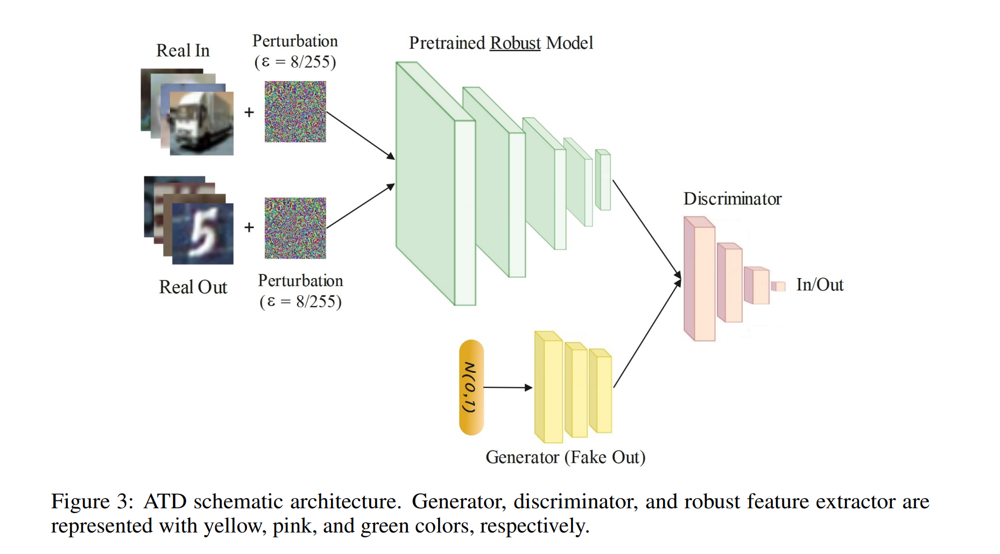
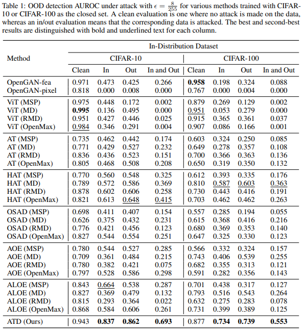

# Your Out-of-Distribution Detection Method is Not Robust!
This repository contains the code for the paper "[Your Out-of-Distribution Detection Method is Not Robust!](https://arxiv.org/abs/2209.15246)". 
Out-of-distribution (OOD) detection has recently gained substantial attention due to the importance of identifying out-of-domain samples in reliability and safety. Although OOD detection methods have advanced by a great deal, they are still susceptible to adversarial examples. 
To mitigate this issue, we propose the Adversarially Trained Discriminator (ATD), which utilizes a pre-trained robust model to extract robust features, and a generator model to create OOD samples. This method could significantly outperform previous methods.


## Illustration


## Experimental Results
<p align="center" >

</p>


## Preliminaries

It is tested under Ubuntu Linux 20.04.3 LTS and Python 3.8.10 environment, and requires some packages to be installed:
* [PyTorch](https://pytorch.org/)
* [RobustBench](https://github.com/RobustBench/robustbench)
* [numpy](http://www.numpy.org/)
* [sklearn](https://scikit-learn.org/stable/)
* [OpenCV](https://pypi.org/project/opencv-python/)
## Downloading In-distribution Datasets
* [CIFAR](https://www.cs.toronto.edu/~kriz/cifar.html): Included in TorchVision. 
* [TinyImageNet](http://cs231n.stanford.edu/tiny-imagenet-200.zip): Download and extract to `data/tiny-imagenet-200` folder.
## Downloading Auxiliary OOD Datasets

* [SVHN](http://ufldl.stanford.edu/housenumbers/test_32x32.mat): Included in TorchVision.
* [Food101](http://data.vision.ee.ethz.ch/cvl/food-101.tar.gz) : Download and extract to `data/food-101` folder. 
## Downloading Out-of-distribution Test Datasets
links and instructions to download each dataset are provided below:
* [MNIST](http://yann.lecun.com/exdb/mnist/): Included in PyTorch.
* [TinyImageNet](http://cs231n.stanford.edu/tiny-imagenet-200.zip): Download and extract to `data/tiny-imagenet-200` folder.
* [Places365](https://dl.dropboxusercontent.com/s/3pwqsyv33f6if3z/val_256.tar):  Download and extract to  `data/val_256`. These two files  ([places365_val.txt](https://dl.dropboxusercontent.com/s/gaf1ygpdnkhzyjo/places365_val.txt), [categories_places365.txt](https://dl.dropboxusercontent.com/s/enr71zpolzi1xzm/categories_places365.txt))
should also be downloaded and put in the `data` folder.
* [LSUN](https://www.dropbox.com/s/moqh2wh8696c3yl/LSUN_resize.tar.gz): Download and extract to `data/LSUN_resize`.
* [iSUN](https://www.dropbox.com/s/ssz7qxfqae0cca5/iSUN.tar.gz): Download and extract to `data/iSUN`.
* [Birds](https://www.dropbox.com/s/yc6kz6ld56q836c/images.tgz): Download and extract to `data/images`.
* [Flowers](https://dl.dropboxusercontent.com/s/hbt8e7wjiplryoo/102flowers.tgz): Download and extract to `data/flowers`. You should add another folder in this directory and move at least one image to it to avoid TorchVision error.
* [COIL-100](http://www.cs.columbia.edu/CAVE/databases/SLAM_coil-20_coil-100/coil-100/coil-100.zip): Download and extract to `data/coil`.

For example, run the following commands in the **root** directory to download **LSUN**:
```
cd data
wget https://www.dropbox.com/s/moqh2wh8696c3yl/LSUN_resize.tar.gz
tar -xvzf LSUN_resize.tar.gz
```
## Downloading Pre-Trained Models
We provide pre-trained ATD models on CIFAR-10, CIFAR-100, and TinyImageNet as the in-distribution datasets, which can be downloaded from [Google Drive](https://drive.google.com/drive/folders/1W269RMnWXdN_YWJBdKSk8PoU-Zo7mHmS).
To test the checkpoint for TinyImageNet, you should also download `weights-best-TI.pt` from the above Google Drive folder to the `models` folder.
## Overview of the Code

### Training Option and Description
The options for the training and evaluation code is as follows:

* `run_name`: This is used in checkpoint name.
* `model_type`: {`pix`: Feature extractor not used. `fea`: Feature extractor is added to the model. } 
* `training_type`: {`clean`: Standard training. `adv`: Adversarial training. } 
* `in_dataset`:{`cifar10`, `cifar100`, `TI`}. CIFAR-10, CIFAR-100, and TinyImageNet are considered as in-distribution datasets.
* `alpha`: α coefficient in the equation 9. 
* `batch_size`: Batch size.
* `num_epochs`: Number of training epochs. 
* `eps`: Attack perturbation budget.  
* `attack_iters`: Number of iterations in PGD attack.
* `seed`: Seed used to make code behaviour deterministic.
* `out_datasets`: OOD Datasets used for evaluation. 

### ATD Training
```
python train_ATD.py  --run_name cifar10 --model_type "fea" --training_type "adv" --in_dataset cifar10 --alpha 0.5 --batch_size 128 --num_epochs 20 --eps 0.0313 --attack_iters 10 
```

### ATD Evaluation
``` 
python test_ATD.py  --run_name cifar10 --model_type "fea" --in_dataset cifar10 --batch_size 128 --eps 0.0313 --attack_iters 100 --out_datasets 'mnist' 'tiny_imagenet' 'LSUN'
```

## Acknowledgements
Part of this code is inspired by [OpenGAN](https://github.com/aimerykong/OpenGAN), [ATOM](https://github.com/jfc43/informative-outlier-mining), [RobustBench](https://github.com/RobustBench/robustbench), [RobustOverfitting](https://github.com/locuslab/robust_overfitting), and [HAT](https://github.com/imrahulr/hat).
## Citation 
Please cite our work if you use the codebase: 
```
@article{azizmalayeri2022your,
  title={Your Out-of-Distribution Detection Method is Not Robust!},
  author={Azizmalayeri, Mohammad and Moakhar, Arshia Soltani and Zarei, Arman and Zohrabi, Reihaneh and Manzuri, Mohammad Taghi and Rohban, Mohammad Hossein},
  journal={arXiv preprint arXiv:2209.15246},
  year={2022}
}
```

## License
Please refer to the [LICENSE](LICENSE).
